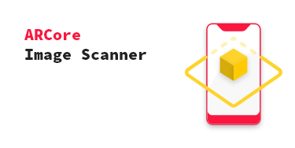
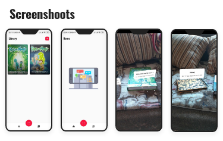

     

    

    

## Tech-stack  

Min API level is set to [`24`]  
  
* Tech-stack  
  * [Kotlin](https://kotlinlang.org/) + [Coroutines](https://kotlinlang.org/docs/reference/coroutines-overview.html) - perform background operations  
  * [Jetpack](https://developer.android.com/jetpack)  
 * [Navigation](https://developer.android.com/topic/libraries/architecture/navigation/) - deal with whole in-app navigation  
      * [LiveData](https://developer.android.com/topic/libraries/architecture/livedata) - notify views about database change  
      * [Lifecycle](https://developer.android.com/topic/libraries/architecture/lifecycle) - perform an action when lifecycle state changes  
      * [ViewModel](https://developer.android.com/topic/libraries/architecture/viewmodel) - store and manage UI-related data in a lifecycle conscious way  
  * [Coil](https://github.com/coil-kt/coil) - image loading library with Kotlin idiomatic API  
* Architecture  
  * MVVM  
  * [Android Architecture components](https://developer.android.com/topic/libraries/architecture) ([ViewModel]
